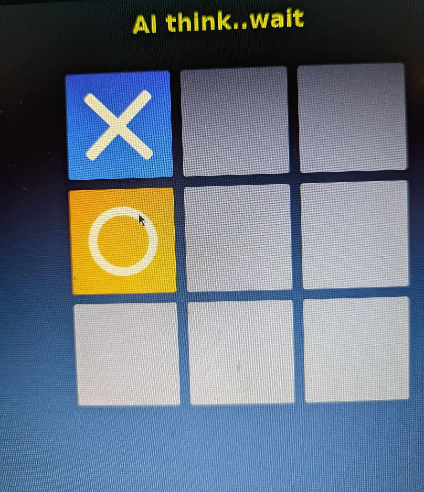

# Tic Tac Toe The Ultimate Collection.

## Play vs AI-dummy,max AI,or Friend ✅  

## Zoom to fit any sceen ✅

## Choose who start any game ✅

**Demo Link;**

- https://kaliscandinavia.github.io/TicTacToe

  **OS compatibility.Tested on** ✅
    
  ..
  .
  
  

**
AI  Waiting For You !
**

**Code language used;**

  

(<a href="#up"</a>Up to top)
  

(<a href="https://github.com/kaliscandinavia/ ">To Kali Scandinavia</a>)

